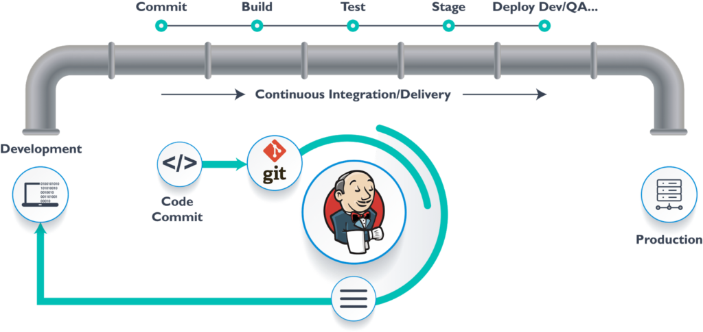
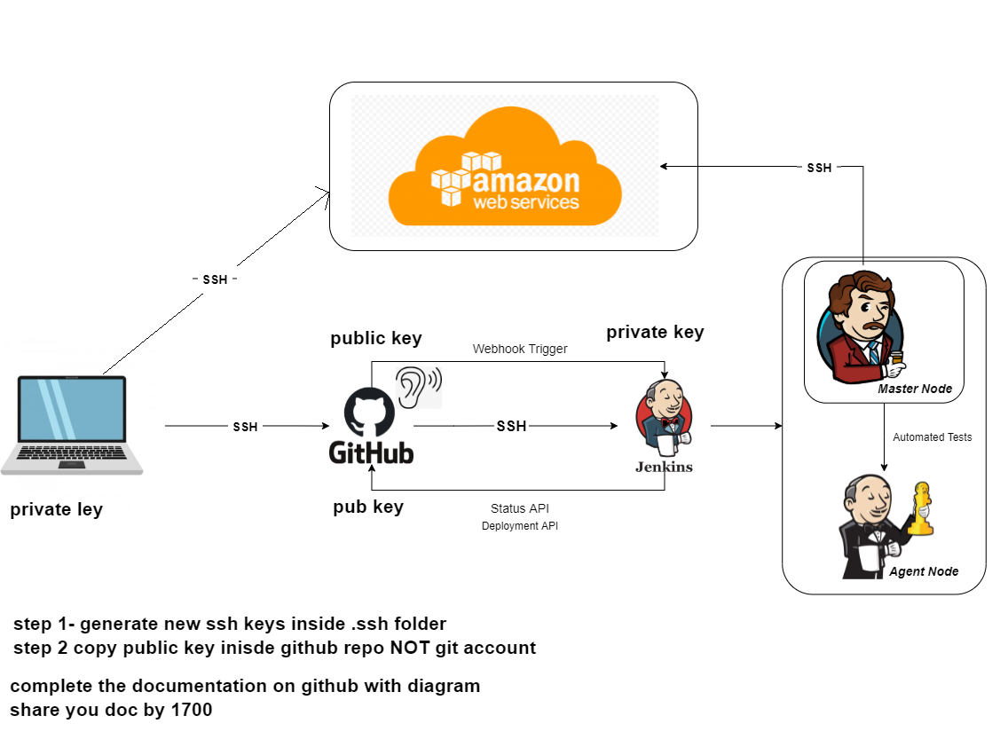
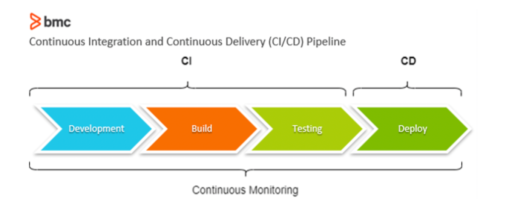
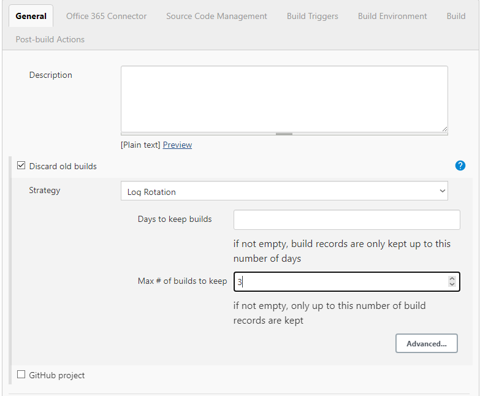
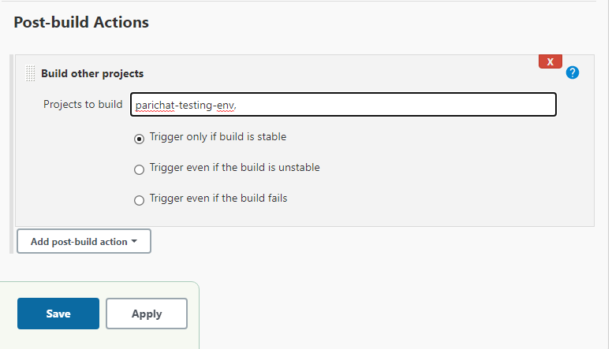

# CI/CD
Continuous Integration and Continuous deployment pipelines. It is a method of frequently deliver apps to customers by introducing automation into the stages of app development.

## Why Jenkins?
It is an opensoure automation server which means it's free to use. It provides a wide range of plugins for integration with many test automation tools and frameworks into the test pipeline.



## CI/CD tools
* GitLab - provides version control, issue tracking and CI/CD capabilities in a signle application.
* Azure DevOps - owned by Microsoft cloud-based platform providing tools for soruce control, build automation, testing and deployment.
* Travis CI - a cloud-based CI/CD platform which intergrates well with Github and offers a simple configuration process. 
* CircleCI - a cloud-based CI/CD platform that offer easy configuration and supports a wide range of programming languages and environments.

## Why buid a pipeline? what are business values?
Benefits of buidling a CI/CD pipeline:
* **Time efficiency** - CI/CD pipelines automate and streamline the software delivery process. This reduces time spent on manual processes and accelerates the time it takes to deliver value to customers.
  
* **Improve quality** - CI/CD pipelines help automated testing, enabling to discover bugs and issue early. By continuously integrating and testing code changes, the business ensures that only quality and reliable software is deployed. Resulting in better customer satisfaction.

* **Increase collaboration and Efficiency** - it encourages collaboration among development, testing and operations teams. This is because it provides an automated workflow, different teams can work together smoothly and continuously. 

* **Continuous improvements** - CI/CD pipelines facilitates a cultire of continuous improvement by providing feedback loops and monitoring performance. This allows the business to discover areas of improvements and can implement changes to enhance software delivery and quality over time.

In summary, CI/CD pipelines allow the business to speed up the software development process significantly. Also, they improve the quality of the software since the code is released in small batch and it is possible to test it thoroughly, allowing to detect and fix bugs before the software is deployed. 

## CI/CD Architecture



Webhook triggers are an automatic trigger that listens for a c

## Implementing CI/CD pipelines
1) Development - this stage involves writing and implementing the code: adding new features, fixing bugs and making enhancements according to the requirements and specifications.
2) Build - the build stage prioritising on compling, linking and packaging the source code into a deliverable form.
3) Test - this stage is used to verify the functionality, quality and reliability of the software.
4) Deploy - the deploy stage involves making the software available for use.



## Create a job in Jenkins
1) Create new time
2) Enter a name: *parichat-testing-evn *
3) Select Freestyle project
   1) Select *Discard old build* 
      * Max # of builds to keep: 3 

        

4) Build
   * `uname -a` 

## Post build action
This allows a second job to run after the first job is successful.

On the build page:
   * Select *Build other projects*
   * Select a project
      


## Master and Agent nodes
master node is like a controller management with auto scaling group in place.
Agent node helps reduce the load from the master


## Connect jenkins with github using ssh
1) Create a new job
2) Name
3) Description
4) Discard old builds: 3
5) Github project: project url *https://github.com/jungjinggg/tech241_sparta_app.git*
6) Soruce Code management
   1) Git
   2) Enter repo URL: ssh
   3) Add: Kind *SSH Useranem with private key*  
   4) Enter username
   5) Paste *private key*
7) Build environment
   1) Provide Node&npm
8) Build
   1) execute shell
      ```shell
      cd app
      npm install
      npm test
      ```
9) office 365 connector: Restrict where this project can be run *sparta-ubuntu-node* 


## Webhooks
[how to create webhooks on github to jenkins](webhooks.md)