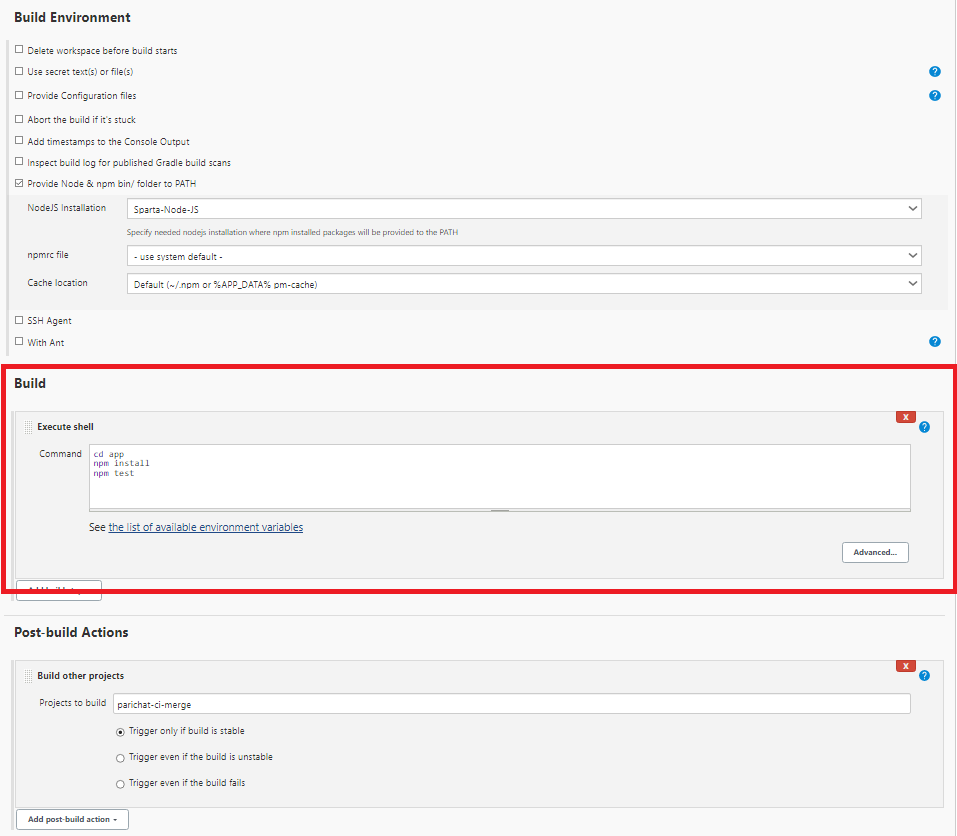
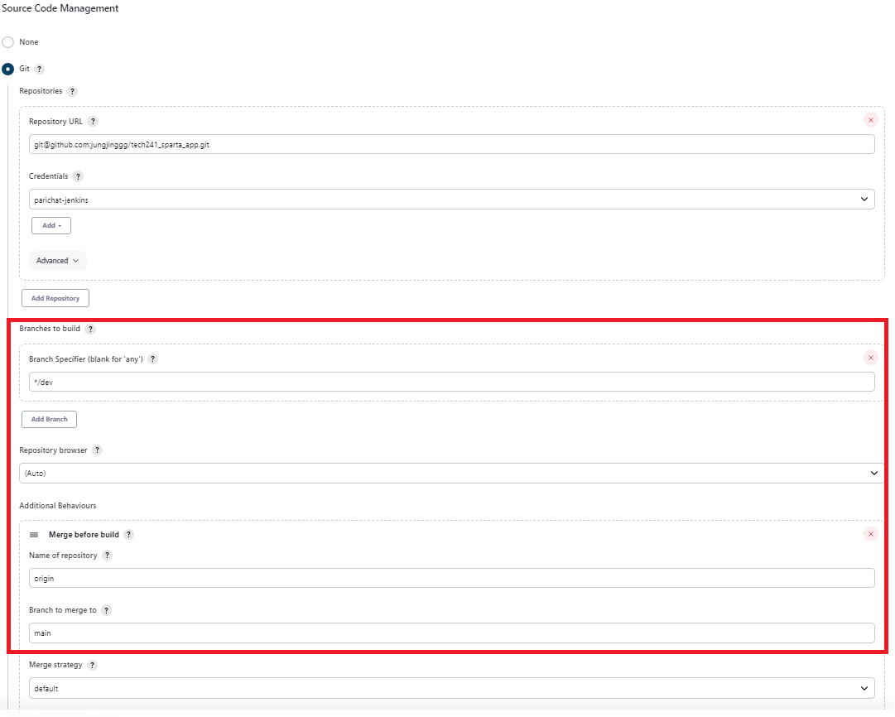
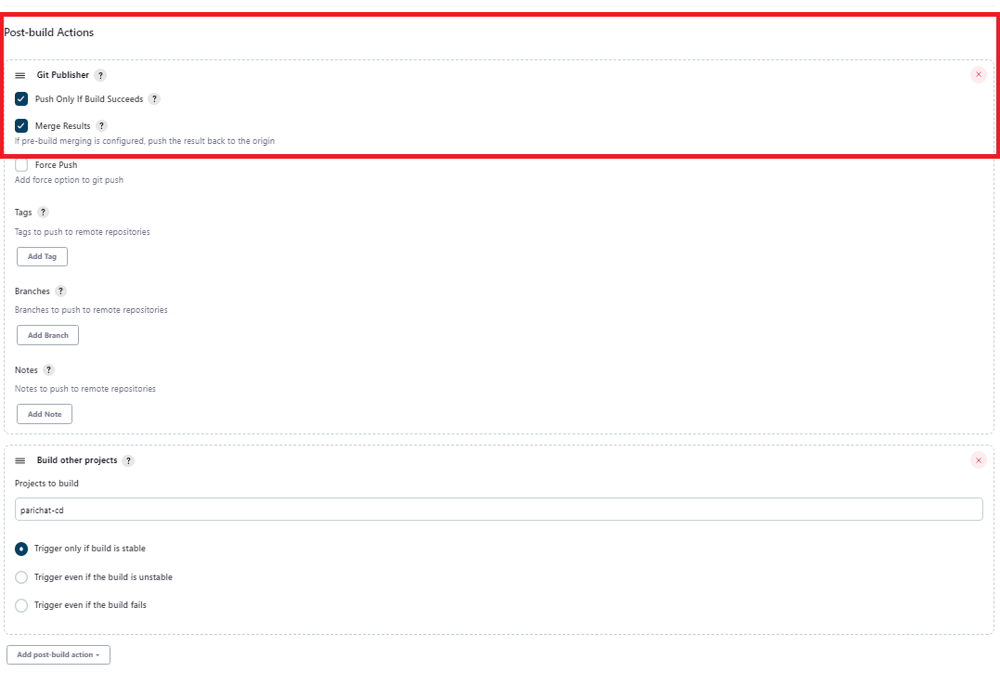
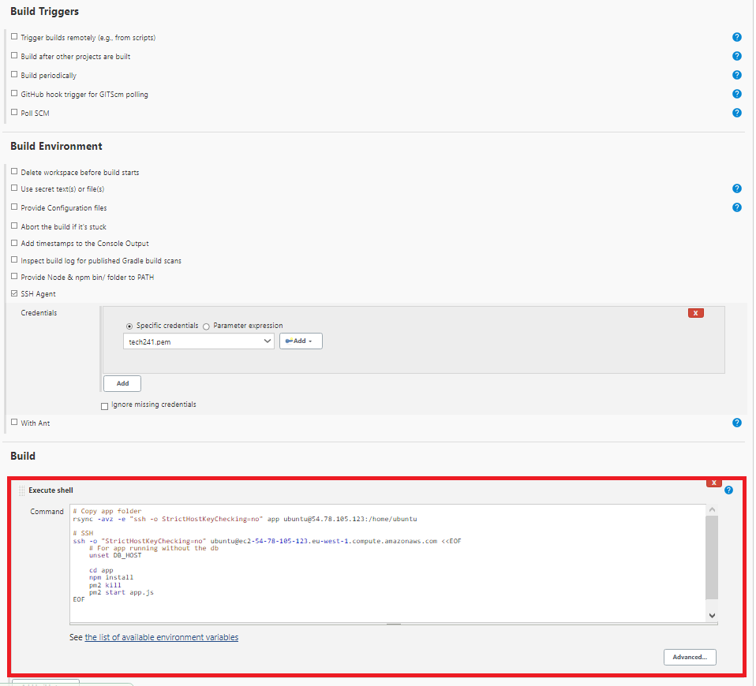

# CI/CD on jenkins


## Job 1: Test on dev branch
This job is for testing the npm




## Job 2: Merge dev branch to main branch 
1) Create a dev branch on github
2) Make a change to dev branch and push the commit (webhook should trigger the job on Jenkins)
3) If the test passed, the code should then be merged from dev to main branch
   
   

   


## Job 3: copy app from the main branch and push to production
1) Copy the app folder
2) SSH into EC2 instance
3) Navigate to the app folder
4) Npm install
5) Npm start

```shell
# Copy app folder
rsync -avz -e "ssh -o StrictHostKeyChecking=no" app ubuntu@54.78.105.123:/home/ubuntu

# SSH
ssh -o "StrictHostKeyChecking=no" ubuntu@ec2-54-78-105-123.eu-west-1.compute.amazonaws.com <<EOF
    # For app running without the db
    unset DB_HOST

    cd app
    npm install
    pm2 kill
    pm2 start app.js
EOF
```




## Note

`scp` command is considered to be more secure than `rsync`

## Blockers
### On CI merge
* `git fetch orgin` and `git push origin` main comes up with error of ***Host key verification falied*** fixed by adding Git Publisher to ***push only if build succeeds***

### On CD job
1) 502 bad gateway fixed by adding `npm install`
2) scp didn't work, fixed by using rsync
