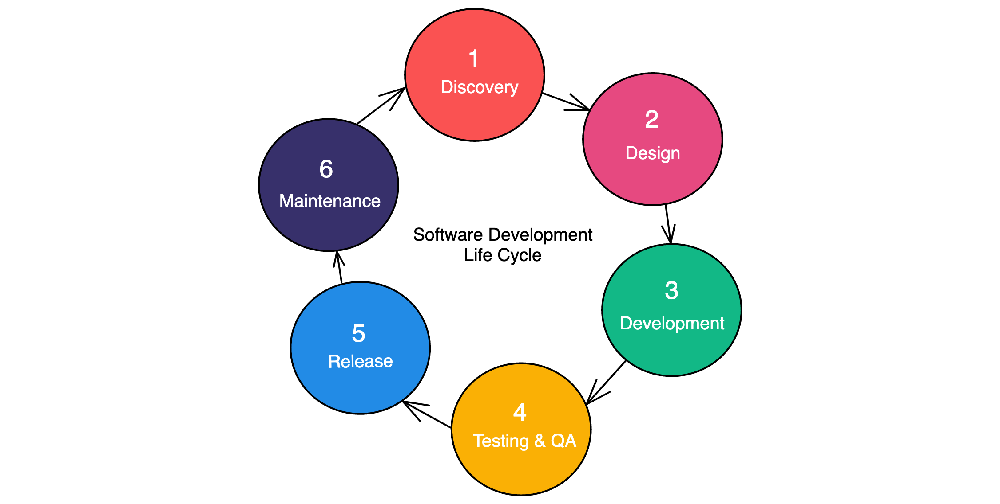

# CI/CD

## Diagram of CI/CD

## Git workflow diagram

## What is CI/CD and CDE?
* Continuous Integration (CI) is a workflow typically involves developers pushing their code changes to a version control system: Git. The CI server autometically triggers a build process, run tests if the tests are failed, the feedback will be sent to developers with errors.
* Continuous Delivery (CD) after the tests on CI are successful, the CD workflow automates the deployment process.

## Difference between CD and CDE
CDE workflow goes a step further and autometically deploys the application to production without any manual intervention.

The difference between CD and CDE is that cd includes the automation of the deployment process up to a certain stage  while CDE automates the deployment all the way to production without manual intervention 

## What is Jenkins? How does it work?
Jenkins is an opensoure automation server which means it's free to use. It provides a wide range of plugins for integration with many test automation tools and frameworks into the test pipeline.

## Why should we use Jenkins? Other tools?
* It allows to enables automation of repetitive tasks, reducing manual effort and errors.
* Facilitates faster feedback on code quality through automated testing.
* Integrates with a wide range of tools and technologies, allowing for a seamless DevOps toolchain.

**Other tools**
* GitLab - provides version control, issue tracking and CI/CD capabilities in a signle application.
* Azure DevOps - owned by Microsoft cloud-based platform providing tools for soruce control, build automation, testing and deployment.
* Travis CI - a cloud-based CI/CD platform which intergrates well with Github and offers a simple configuration process. 
* CircleCI - a cloud-based CI/CD platform that offer easy configuration and supports a wide range of programming languages and environments.

## Jenkins workflow

## Software Development Life Cycle (SDLC) workflow stages
