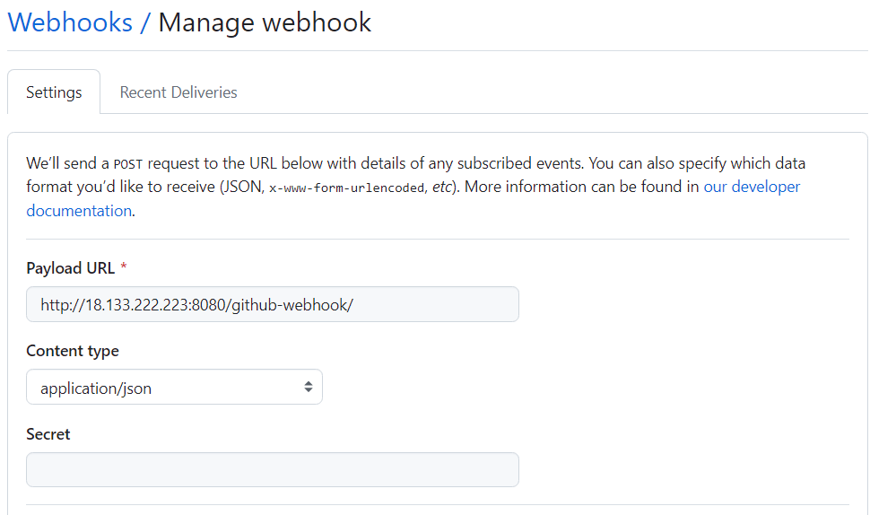
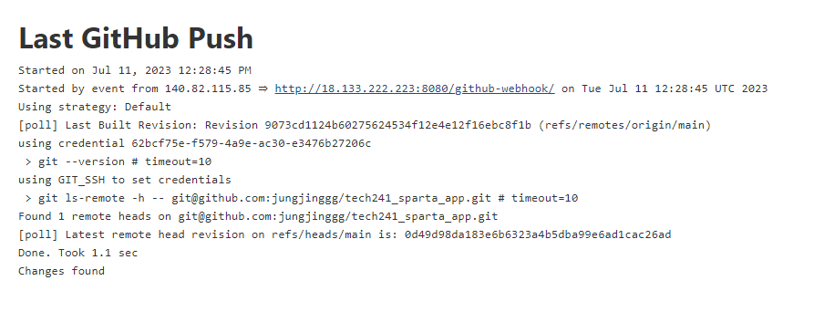

# Webhook on Github

### On github
Add webhooks
    

### On Jenkins
1) Create a new job
2) Name
3) Description
4) Discard old builds: 3
5) Github project: project url *https://github.com/jungjinggg/tech241_sparta_app.git*
6) Soruce Code management
   1) Git
   2) Enter repo URL: ssh
   3) Add: Kind *SSH Useranem with private key*  
   4) Enter username
   5) Paste *private key*
7) Build environment
   * Provide Node&npm
8) Build Triggers: Select *GitHub hook trigger for GITsm polling*
8) Build
   * execute shell
      ```shell
      cd app
      npm install
      npm test
      ```
9) office 365 connector: Restrict where this project can be run *sparta-ubuntu-node* 

If set up correctly, when push a commit, Jenkins will log the last GitHub Push.

